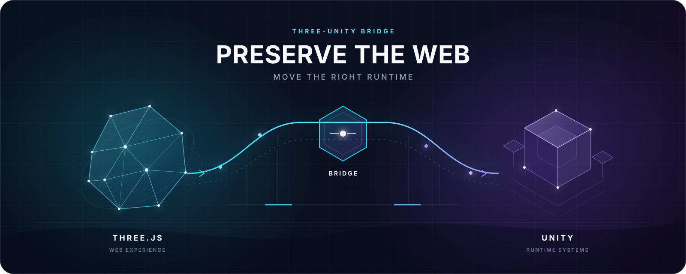
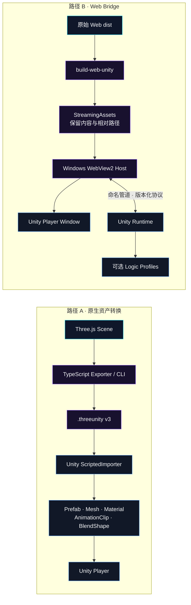

<p align="center">
  
</p>

<h1 align="center">Three Unity Bridge</h1>

<p align="center">
  <strong>保留 Web 的完整体验，把适合的运行时职责交给 Unity。</strong>
</p>

<p align="center">
  将受支持的 Three.js 场景、动画与 Morph Target 转换为 Unity 原生资产，<br>
  或把原始 Web 游戏原样封装进 Windows Player，再按需把确定性逻辑交给 Unity。
</p>

<p align="center">
  
  
  
  
  
  
</p>

<p align="center">
  <a href="#选择你的路径">选择路径</a> ·
  <a href="#架构">架构</a> ·
  <a href="#快速开始">快速开始</a> ·
  <a href="#能力矩阵">能力矩阵</a> ·
  <a href="#已验证证据">验证证据</a> ·
  <a href="#明确边界">明确边界</a>
</p>

> [!IMPORTANT]
> 一个桥，两种迁移策略：需要 Unity 原生资产时转换；需要完整网页保真时承载。两条路径都强调清晰的所有权边界，而不是用低保真近似替代原项目。

## 选择你的路径

| | 资产转换 | Web Bridge |
|---|---|---|
| 最适合 | 需要 Unity Prefab、Mesh、Collider、Controller 的场景 | 必须保留原版画面、DOM UI、输入、音频和存档的完整游戏 |
| 渲染 | 将受支持的 Three.js 数据重建为 Unity 原生资产 | 继续使用原版 Three.js / WebGPU / WebGL |
| 游戏逻辑 | 任意 JavaScript 不会自动转换 | 原 JavaScript 默认保留；合适的职责可通过 profile 交给 Unity |
| 主要产物 | `.threeunity`、Prefab 型资产、子资产、Playable Scene | Windows Unity Player、原始 `dist`、嵌入式 WebView2 Host |
| 入口命令 | `build-unity` | `build-web-unity` |

### 路径 A：Unity 原生资产

导出器读取 Three.js Scene/Object3D，把受支持的层级、Mesh、材质、纹理、Camera、Light、Skin、动画与 Morph Target 写入版本化 `.threeunity`。Unity `ScriptedImporter` 再生成可拖入 Scene 的 Prefab 型主资产，以及 Mesh、Material、Texture、AnimationClip 等子资产。

### 路径 B：完整 Web 体验

Web Bridge 把源 `dist` 的内容和相对路径原样放入 `StreamingAssets`，由 Windows WebView2 Host 嵌入 Unity Player 窗口。DOM、CSS、Three.js 渲染、输入、音频、持久化与浏览器 fallback 仍由原网页拥有；Unity 只接管明确协商的运行时职责。

## 架构



- Asset Path 让 Unity 拥有受支持的渲染资产、动画、碰撞与控制器。
- Web Path 继续让浏览器拥有 DOM、CSS、Three.js 渲染、输入、音频与持久化。
- Logic Profile 只迁移适合固定步长和确定性执行的职责。
- 通用 Runtime 与 Host 不按游戏名称分支；项目差异留在 profile 和薄适配层。

## 能力矩阵

| 能力 | 资产转换 | Web Bridge |
|---|:---:|:---:|
| Mesh、Submesh、Normal、UV、Vertex Color | ✅ Unity 原生资产 | ✅ 原版 Web 渲染 |
| 基础材质与可嵌入纹理 | ✅ | ✅ 原样保留 |
| Perspective / Orthographic Camera、Light | ✅ | ✅ 原样保留 |
| Skeleton、四权重 Skinning、Bind Pose | ✅ Format v2+ | ✅ 原样保留 |
| Position / Quaternion / Scale 动画 | ✅ Format v2+ | ✅ 原样保留 |
| Morph Target / Unity BlendShape | ✅ Format v3 | ✅ 原样保留 |
| DOM / CSS UI | — | ✅ |
| 原 JavaScript 游戏逻辑 | — | ✅ |
| 输入、音频、存档 | 不自动转换 | ✅ |
| Unity Collider / Controller | ✅ Runtime Profile | 可选 |
| Unity 权威逻辑 | 通过项目组件实现 | ✅ 可选 Logic Profile |
| 项目 C# 组件绑定 | ✅ 显式注册 | 可通过协议集成 |
| 输出平台 | Unity 资产；CLI Player 构建当前为 Windows | Windows + WebView2 |

## 快速开始

### 环境

- Node.js 20+
- Three.js `>= 0.160.0 < 1`
- Unity Editor；UPM 声明兼容 Unity 2021.3+
- Web Bridge 额外需要 .NET 8 SDK 与 WebView2 Evergreen Runtime
- 当前仓库验证环境：Unity `6000.3.22f1`

### 最短路径体验 Morph Target → BlendShape

```powershell
npm install
npm run example:morph
node .\dist\cli.js validate .\examples\output\morph-target-animation.threeunity
```

这会生成 `examples/output/morph-target-animation.threeunity`：包含 `Bulge`、`Twist` 两个 Morph Target、初始权重与循环 morph-weight 动画。

把 UPM 包和资产安装到已有 Unity 项目：

```powershell
node .\dist\cli.js install-unity C:\Path\To\UnityProject
node .\dist\cli.js copy `
  .\examples\output\morph-target-animation.threeunity `
  C:\Path\To\UnityProject
```

也可以在 Unity Package Manager 选择 **Add package from disk**，打开 `unity-package/package.json`，再从 **Samples** 导入示例。

### 从 Three.js 代码导出

```ts
import { writeFile } from "node:fs/promises";
import { exportThreeUnityJson } from "three-unity-bridge";

const json = await exportThreeUnityJson(scene, {
  name: "Level 01",
  unitScaleMeters: 1,
  extraObjects: [gameCamera],
  animations: clips,
  defaultAnimation: "Walk",
  autoplayAnimation: true,
  animationLoop: true,
  animationSampleRate: 30,
});

await writeFile("level-01.threeunity", json, "utf8");
```

浏览器环境可改用 `downloadThreeUnity(json, "level-01.threeunity")`。`extraObjects` 用于保留未挂在 Scene 树下、但实际参与渲染的 Camera 等对象。

### 构建原生资产 Player

```powershell
npm run example
node .\dist\cli.js build-unity `
  .\examples\output\three-unity-demo.threeunity `
  C:\Path\To\UnityProject `
  --unity "C:\Program Files\Unity\Hub\Editor\6000.3.22f1\Editor\Unity.exe" `
  -o .\Build\ThreeUnityDemo.exe
```

这里改用自带 Camera 与 Light 的静态示例，确保生成的 Player 有可见首帧。`build-unity` 会安装/更新 UPM 包、复制资产、生成 Playable Scene，并构建 `StandaloneWindows64` Player。

### 构建 Web Bridge Player

```powershell
npm run build
node .\dist\cli.js build-web-unity `
  C:\Path\To\WebGame\dist `
  C:\Path\To\UnityProject `
  --name MyGame `
  -o .\Build\MyGame\MyGame.exe
```

可选参数包括 `--entry index.html`、`--unity Unity.exe`，以及 `--logic-profile voxel-player-v1|shop-flight-v1`。

## `.threeunity` 格式与转换规则

| 格式 | 能力 | 兼容状态 |
|---|---|---|
| v1 | 静态层级、Mesh、材质、纹理、Camera、Light | importer 继续接受 |
| v2 | SkinnedMesh、四权重、Bind Pose、Transform Animation | importer 继续接受 |
| v3 | Morph Target delta、初始 morph weights、morphWeight Animation | 当前 exporter 输出 |

> [!NOTE]
> npm 与 UPM 元数据当前仍为 `0.1.0`；格式版本、ScriptedImporter revision 与软件版本是三套独立概念。

关键规则：

- Three.js 与 Unity 都是 Y-up，但手性不同；importer 镜像 Z，并把每个三角形绕序反转一次。
- `unitScaleMeters` 应用于位置、position morph delta、Camera 裁剪面和 Light range，不应用于 normal delta。
- Skin、Bone、动画目标和 Morph 动画以稳定 node id / target index 关联，不依赖名称唯一。
- Three.js absolute / relative Morph Target 在导出时统一规范为 delta；Unity 不猜测源语义。
- 动画通过固定采样 `AnimationMixer` 烘焙；导出后恢复调用方 Transform 与全部 morph influences。
- 有 Skin 或 Morph Target 的 Mesh 使用 `SkinnedMeshRenderer`；skin + morph 共用同一个 Renderer。
- Unity 动画作为 legacy `AnimationClip` 子资产导入，由 `ThreeUnityAnimationPlayer` 循环播放，不额外建设 Animator Controller。

## 可运行示例

| npm script | 输出 | UPM Sample | 展示内容 |
|---|---|---|---|
| `npm run example` | `three-unity-demo.threeunity` | Imported Triangle | 静态层级与最小 importer 闭环 |
| `npm run example:animated` | `animated-skinned-mesh.threeunity` | Animated Skinned Mesh | Bone、Skinning、Bind Pose 与循环 AnimationClip |
| `npm run example:morph` | `morph-target-animation.threeunity` | Morph Target Animation | `Bulge` / `Twist` BlendShape 与 morph-weight 动画 |
| `npm run example:components` | `component-binding-door.threeunity` | Component Binding Door | descriptor 显式绑定项目自有 `Door` MonoBehaviour |

四个 Sample 都随 UPM 包提供，可从 Package Manager 的 Samples 页面直接导入。动画 Sample 拖入 Scene 后进入 Play 即可运行，不需要额外 Animator Controller。

## Web Bridge 运行时

### 核心设计契约

- 源 `dist` 的文件内容和相对路径保持不变，不用视觉近似替代原游戏。
- 协议版本化并按逻辑 session 隔离；旧 session 的迟到消息不能重新取得控制权。
- Reliable 消息保序；Realtime 状态按 `sessionId + type` 有界合并，二者不会永久互相饿死。
- Pipe 与 WebView I/O 不阻塞 Unity 主线程。
- Unity→Web 启动消息同时等待 navigation 与当前 document 的 listener ACK。
- Host 在创建 WebView 子进程前加入 Windows Job；替换代际串行，Player 退出后不遗留子进程。
- 通用 Runtime 与 Host 不按游戏名称分支。

### 可复用 Logic Profiles

- `voxel-player-v1`：Unity 负责玩家移动、跳跃/飞行与体素碰撞；Web 保留 Three.js 渲染和 UI。
- `shop-flight-v1`：Unity 负责起飞/降落缓动、飞行时钟、位置与旋转；Web 保留内容生成、渲染、DOM HUD、音频、导出和存档。

游戏侧只需要薄适配层：提供当前快照、把 Unity 状态应用回 Three.js，并保留原 JavaScript 帧函数作为 fallback。可复制入口见 [`examples/logic-adapters/name-to-shop/unity-flight-adapter.js`](examples/logic-adapters/name-to-shop/unity-flight-adapter.js)。

## 显式组件绑定

Three.js 的 `userData.unity.components` 会以 `type + dataJson` 保留到 Unity：

```ts
doorPivot.userData = {
  unity: {
    components: [
      { type: "Door", data: { openAngle: 95, duration: 0.45 } },
    ],
  },
};
```

项目必须显式注册允许创建的 C# 类型；包不会扫描程序集或猜测类名：

```csharp
ThreeUnityComponentBindings.Register<DoorData, Door>(
    "Door",
    (door, data) => door.Configure(data.openAngle, data.duration, data.startsOpen));
```

完整示例位于 [`unity-package/Samples~/Component Binding Door`](unity-package/Samples~/Component%20Binding%20Door)。未登记的 descriptor 仍保留在 metadata 中，但不会被执行。

## 已验证证据

下表只记录仓库已有的测试、构建和运行证据。自动化断言、实体 Player 记录、性能基准与人工观察互不替代。

| 快照 | 证据 |
|---|---|
| 2026-08-31 / `6e9659b` | `npm run build` PASS；Node 65/65；.NET Host 26/26；Unity EditMode 87/87；Morph 示例与 CLI validate PASS |
| 2026-08-30 conversion snapshot | Voxel Frontier、LittleCubes、Warptracker 三个检入资产通过当时的 CLI validate、Unity 批处理导入和 `StandaloneWindows64` Player 构建 |
| 2026-08-30 physical lifecycle | 两个 logic profile 的实体 Player 故障注入均到达新 session ready 与后续 logic tick；`shop-flight-v1` 记录最大 Host 并发 1，LittleCubes 记录 `OrphanHost=False` |

当前记录中的固定工作负载结果：

| 场景 | 记录结果 |
|---|---:|
| name-to-shop 空闲 Unity→Web 消息 | `−89.1%` |
| LittleCubes 240 FPS Web→Unity 输入消息 | `−94.2%` |
| LittleCubes 体素碰撞采样 | `−90.8%` |

这些数字是相同工作负载下的记录值，不是对任意项目的普遍性能保证。测试方法、队列字段与扩展约束见 [`docs/BRIDGE_PERFORMANCE.md`](docs/BRIDGE_PERFORMANCE.md)。

> [!WARNING]
> 最新 Morph Target v3 已通过 Unity `BakeMesh` 变形与 bounds smoke，但没有新增 Game View 人工视觉观察；自动化证据不替代视觉/UI/输入验收。

## 明确边界

Three Unity Bridge 是场景、运行时与宿主桥，不是 JavaScript → C# 通用编译器。

- 资产路径不会自动迁移 DOM/CSS、任意 JavaScript、音频、存档、WebXR 或自定义 GLSL。
- Web Bridge 当前仅支持 Windows，并依赖 WebView2 Evergreen Runtime。
- Morph tangent、progressive multi-frame BlendShape、材质/UV 动画仍未支持。
- Humanoid Avatar、重定向、IK、root motion、Animator Controller 与 Blend Tree 不在当前范围。
- HDRP 专用映射、粒子与后处理尚未覆盖。
- 外链纹理必须在导出时可读取；跨域资源仍受 CORS 约束。
- `InstancedMesh` 当前展开为多个 GameObject，超大场景尚未使用 GPU instancing 或二进制载荷。
- 项目组件只能通过显式白名单绑定；descriptor 本身不会把任意 JavaScript 翻译成 C#。

## 仓库结构

| 路径 | 职责 |
|---|---|
| `src/` | TypeScript exporter、CLI、协议与 browser-side logic SDK |
| `unity-package/` | UPM Runtime、Editor importer、Shaders、Samples 与 EditMode tests |
| `webview-host/` | .NET 8 Windows WebView2 Host |
| `webview-host-tests/` | Host 生命周期与恢复测试 |
| `examples/` | 静态、骨骼动画、Morph、组件绑定与 logic adapter 示例 |
| `tests/` | Node 合同、导出器与协议测试 |
| `benchmarks/` | 输入与碰撞 transport 的可复现基准 |
| `conversion-tools/` | 开源游戏 capture 与实体 Player 故障工具 |
| `conversions/` | 已检入的转换资产与证据报告 |
| `docs/` | 性能、协议与架构设计文档 |

## 开发与验证

```powershell
npm run build
npm test
dotnet test .\webview-host-tests\ThreeUnityWebHost.Tests.csproj -c Release
```

修改 UPM Runtime、Editor 或 importer 时，还需要把 `unity-package` 安装到一次性 Unity 项目并运行 EditMode tests；权威结果是已完成、测试数大于 0 且 failures 为 0 的 XML。修改 Web Bridge 生命周期时再运行对应实体 Player fault harness；只有性能改动才运行 benchmarks。

## 进一步阅读

- [Bridge 性能、背压与遥测](docs/BRIDGE_PERFORMANCE.md)
- [开源游戏转换总览](conversions/RESULTS.md)
- [name-to-shop Logic Bridge 结果](conversions/name-to-shop-logic/RESULTS.md)
- [LittleCubes Logic Bridge 结果](conversions/little-cubes-logic/RESULTS.md)
- [Browser-side Logic Adapter](examples/logic-adapters/name-to-shop/README.md)
- [UPM Changelog](unity-package/CHANGELOG.md)

## License

MIT — see [LICENSE](LICENSE).
